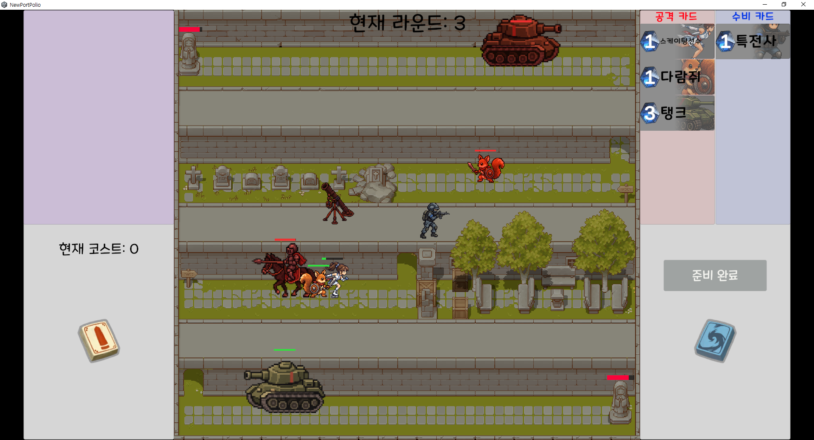

# 디펜스 빌드 아레나

Unity와 C# 서버로 만든 PC용 **1대1 카드 디펜스 게임**입니다.
공격 카드를 사용해 상대 진영으로 유닛을 보내고, 수비 유닛을 자유롭게 배치해 자신의 목적지를 방어합니다.
로비의 덱 편집부터 매칭, 전투, 승패 표시와 로비 복귀까지 한 번의 대전 흐름을 구현했습니다.

**[플레이 영상](https://www.youtube.com/watch?v=Ao4-cSmHB1c)** · [주요 코드](#주요-코드) · [실행 방법](#실행-방법) · [제작 범위와 도구](#제작-범위와-도구)



## 프로젝트 개요

| 항목 | 내용 |
| --- | --- |
| 개발 형태 | 1인 개인 프로젝트. 강의 기반 서버와 AI 도구 활용 범위는 아래에 별도 명시 |
| 개발 기간 | 2024.06 ~ 2026.09, 학습 및 중단 기간을 포함한 비연속 개발 |
| 플랫폼 | Windows |
| 클라이언트 | Unity 6000.4.12f1, C#, UGUI, TextMeshPro, ScriptableObject, DOTween |
| 서버 | C#, TCP 소켓, XML 기반 패킷 코드 생성 |
| 확인 환경 | 같은 PC에서 Unity Editor와 Windows 빌드를 각각 실행하는 2클라이언트 수동 테스트 |

## 플레이 흐름

1. 로비에서 15장으로 덱을 구성하고 매칭을 시작합니다.
2. 준비 단계에서 코스트를 사용해 공격 카드를 등록하거나 수비 유닛을 배치합니다.
3. 전투가 시작되면 공격 유닛은 경로를 따라 이동하고, 수비 유닛은 적을 추격하고 공격합니다.
4. 목적지에 도착한 공격 유닛은 상대 라이프를 감소시킵니다.
5. 라운드를 반복하고, 승패 처리 후 로비로 돌아갑니다.

## 주요 구현

### 씬 초기화와 역할 분리

씬의 `Installer`가 참조 연결과 초기화를 담당하고, 상태 보관, 진행 제어, 화면 표시를 나눴습니다.
UI 입력은 Controller로 전달하며, 네트워크 이벤트는 Gateway를 통해 게임 로직에 연결합니다.
엄격한 MVC 프레임워크보다는 기능별 폴더와 `State / Controller / View` 책임 분리를 적용했습니다.

### 두 클라이언트의 전투 동기화

각 클라이언트가 모든 전투를 독립적으로 계산하지 않도록, 자신이 소유한 유닛의 상태를 상대에게 전달합니다.

| 대상 | 상태를 결정하는 쪽 | 전달 정보 |
| --- | --- | --- |
| 수비 유닛 | 해당 유닛의 소유 클라이언트 | 이동, 타깃, 공격 이벤트 |
| 공격 유닛 | 해당 유닛의 소유 클라이언트 | 이동, 피해 적용 후 체력, 사망, 목적지 도착 |
| 게임 룸과 라운드 | 서버 | 매칭, 준비 확인, 전투 시작, 승패 결과 |

예를 들어 A의 수비 유닛이 B의 공격 유닛을 공격하면, 공격자 ID·대상 ID·피해량을 서버를 거쳐 B에 전달합니다.
B는 소유한 공격 유닛에 피해를 적용하고 변경된 체력과 사망 상태를 다시 전달합니다.
상대 진영의 배치 좌표를 반전하고 수신 위치를 보간하며, 유닛 생성 전에 도착한 일부 상태 정보는 보관했다가 적용합니다.

### 자유 배치와 수비 유닛 FSM

배치와 이동의 유효 영역을 `Collider2D`로 판정해 타일맵의 시각적 경계와 게임 판정을 분리했습니다.
수비 유닛은 경계·추격·복귀 상태를 사용하며, 정지 사격과 공격 쿨타임, 타깃 교체, 원래 위치로의 복귀를 처리합니다.
필드 스프라이트의 발밑 기준 위치와 피격 판정도 별도로 다룹니다.

### 데이터 수명과 UI

접속 중 유지하는 카드 정보와 로비의 편집 상태를 분리해 로비 복귀 시 덱을 복원합니다.
손패 입력과 표시를 분리하고, 덱·사용 카드 목록의 타입별 조회, 체력바, 전투 연출과 배속을 구현했습니다.

## 주요 코드

| 관심 영역 | 시작할 파일 |
| --- | --- |
| 로비 초기화 | [LobbySceneInstaller](Assets/Scripts/Lobby/LobbySceneInstaller.cs) |
| 덱 편집 | [LobbyDeckController](Assets/Scripts/Lobby/LobbyDeckController.cs), [LobbyDeckState](Assets/Scripts/Lobby/LobbyDeckState.cs) |
| 인게임 초기화 | [InGameSceneInstaller](Assets/Scripts/InGame/Installer/InGameSceneInstaller.cs) |
| 대전 진행 | [InGameFlowController](Assets/Scripts/InGame/Controller/InGameFlowController.cs) |
| 카드 사용 | [CardPlayController](Assets/Scripts/InGame/Controller/CardPlayController.cs) |
| 전투와 동기화 | [CombatRoundManager](Assets/Scripts/InGame/Combat/CombatRoundManager.cs) |
| 수비 유닛 FSM | [DefenseUnit](Assets/Scripts/InGame/Combat/DefenseUnit.cs) |
| 자유 배치 | [DefensePlacementManager](Assets/Scripts/InGame/Service/DefensePlacementManager.cs) |
| 손패 표시 | [InGameHandUI](Assets/Scripts/InGame/View/InGameHandUI.cs) |
| 통신 경계 | [NetworkGateway](Assets/Scripts/Network/NetworkGateway.cs), [PacketHandler](Assets/Scripts/Packet/PacketHandler.cs) |
| 접속 수명 카드 캐시 | [PlayerCardState](Assets/Scripts/CardData/PlayerCardState.cs) |
| 서버 방 처리 | [GameRoom](Server/Server/GameRoom.cs) |

## 실행 방법

### 준비 환경

- Unity Hub와 **Unity 6000.4.12f1**, Windows 빌드 지원 모듈
- C# 서버를 빌드할 수 있는 .NET SDK와 **.NET 6 런타임** (`Server`, `ServerCore`의 대상 프레임워크: `net6.0`)
- 패킷 정의를 변경하는 경우 **.NET 8 SDK**도 필요 (`PacketGenerator`: `net8.0`)

아래 절차는 저장소의 현재 설정을 기준으로 작성했습니다. 별도 PC에서의 클린 설치 검증은 하지 않았습니다.

### 1. 서버 실행

저장소 루트에서 실행합니다.

```powershell
dotnet run --project Server/Server/Server.csproj
```

또는 Visual Studio에서 `Server/Server.sln`을 열고 `Server`를 시작 프로젝트로 설정해 실행합니다.
콘솔에 `Listening...`이 표시되면 클라이언트를 시작합니다.

서버 데이터는 `Server/Server/UserData`의 XML 파일을 사용합니다.
현재 데이터 경로는 기본 빌드 출력 폴더를 기준으로 계산하므로, 서버 실행 파일만 다른 폴더로 옮기는 배포 방식은 지원하지 않습니다.

### 2. 클라이언트 실행

1. Unity Hub에서 이 저장소의 루트 폴더를 프로젝트로 엽니다.
2. 패키지와 에셋 임포트가 끝나면 `Assets/Scenes/A_Lobby.unity`를 엽니다.
3. Windows 빌드의 씬 목록에 `A_Lobby`, `B_InGame`이 순서대로 활성화되어 있는지 확인합니다.
4. Windows 실행 파일을 빌드하고, 같은 PC에서 빌드와 Unity Editor를 각각 실행합니다.
5. 두 클라이언트에서 덱을 확인·저장한 뒤 매칭을 시작합니다.

**현재 서버와 클라이언트는 모두 실행 중인 PC의 호스트 이름을 조회한 첫 번째 주소와 TCP 포트 `7777`을 사용합니다.**
접속 주소를 입력하는 UI는 없습니다. 다른 PC에 서버를 두려면
[서버 진입점](Server/Server/Program.cs)과 [클라이언트 접속 코드](Assets/Scripts/Network/NetworkMananger.cs)의 주소 설정을 맞춰야 합니다.
연결되지 않으면 서버 실행 여부, 양쪽 주소, 포트 사용 상태와 방화벽 허용 여부를 확인합니다.

### 패킷 정의 변경 시

일반 플레이에는 패킷 재생성이 필요하지 않습니다. `Server/PacketGenerator/PDL`을 수정한 경우에만 실행합니다.

```powershell
dotnet build Server/PacketGenerator/PacketGenerator.csproj
cmd /c Server\Common\Packet\GenPackets.bat
```

배치 파일은 생성기를 실행하고 생성된 패킷 코드를 서버와 Unity 클라이언트 등에 복사합니다.

## 확인 범위와 한계

- 제작 과정에서 같은 PC의 Editor와 Windows 빌드로 매칭, 카드 사용, 배치, 전투, 라이프 감소, 승패 표시, 로비 복귀를 수동 확인했습니다.
- 서버는 전투 전체를 시뮬레이션하는 권한 서버가 아니라 메시지 중계와 방 진행을 담당합니다. 클라이언트 조작 방지와 다양한 지연 조건에서의 정합성을 보장하는 구조는 아닙니다.
- 대규모 동시 접속, 장시간 부하, 재접속 복구는 검증 범위에 포함하지 않았습니다.
- 덱 캐시는 전송한 편집 결과를 반영하지만 별도의 서버 저장 완료 응답은 받지 않습니다.
- 인게임 덱빌딩과 카드 특수효과 확장보다 대전 한 판의 완료를 우선한 프로토타입입니다.

## 제작 범위와 도구

### 직접 작업한 범위

<<<<<<< HEAD
**직접 설계·작성한 기능**
=======
- **직접 설계·작성한 기능**
>>>>>>> dcc9f9a5db2f22f35e03da0688856a65638d5717

- [카드 데이터 XML](Server/Server/UserData) 작성과 [서버 유저 데이터 관리](Server/Server/UserData.cs)
- 매칭 시작부터 게임 시작 시 카드 데이터 설정과 덱 구성까지의 초기 처리 흐름
- 팝업 공통 기능을 담당하는 [UIPopup 부모 클래스](Assets/Scripts/UIPopup/UIPopup.cs)
- UI 화면 구성과 프리팹 제작, 게임 맵 구성
- [카드 데이터 구조](Assets/Scripts/CardData/CardData.cs)와 [카드 정보 표시·상호작용](Assets/Scripts/CardUI.cs)

위 기능은 직접 초기 구현했으며, 이후 리팩터링과 AI를 활용한 수정 과정에서 일부 코드가 여러 클래스로 분리되거나 변경되었습니다.
이미지 등 리소스 제작의 AI 활용 범위는 아래에 별도로 명시했습니다.

<<<<<<< HEAD
**기존 코드 또는 AI 제안을 직접 수정한 사례**
=======
- **기존 코드 또는 AI 제안을 직접 수정한 사례**
>>>>>>> dcc9f9a5db2f22f35e03da0688856a65638d5717

초기에는 기능 구현에 집중하면서 한 클래스에 여러 책임이 모이고, 클래스 간 데이터 전달도 복잡해졌습니다.
이를 개선하기 위해 Codex에 구조에 대한 조언을 구하고, 상태·진행 제어·화면 표시를 분리하는 방향을 검토했습니다.

제안된 구조를 이해하고 적용하기 위해 **로비의 덱 편집과 매칭 관련 스크립트는 직접 리팩터링했습니다.**
씬 초기화와 참조 연결, 데이터 보관, UI 표시의 역할을 나누었습니다.
인게임 리팩터링은 AI를 활용해 진행했습니다.

관련 코드: [로비 씬 초기화](Assets/Scripts/Lobby/LobbySceneInstaller.cs), [덱 편집 제어](Assets/Scripts/Lobby/LobbyDeckController.cs), [덱 상태](Assets/Scripts/Lobby/LobbyDeckState.cs), [매칭 제어](Assets/Scripts/Lobby/MatchingController.cs)

<<<<<<< HEAD
**직접 확인한 과정**
=======
- **직접 확인한 과정**
>>>>>>> dcc9f9a5db2f22f35e03da0688856a65638d5717

Unity Editor와 Windows 빌드를 각각 실행해 두 클라이언트로 테스트했습니다.
매칭부터 카드 사용, 유닛 배치, 전투, 승패 표시와 로비 복귀까지 확인하고, 두 화면에서 유닛의 위치·타깃·체력·사망 상태를 비교했습니다.

예상과 다른 동작은 중단점과 디버그 로그로 변수 값과 함수 호출 흐름을 확인했습니다.
수정 후에는 같은 상황을 다시 실행해 동작을 확인하고, 유닛의 이동·추격 시간과 배치 위치 등은 플레이 테스트를 통해 조정했습니다.

### 학습 기반과 AI 활용

서버 프레임워크와 XML 패킷 생성기는 C# Unity 게임 서버 강의의 실습에서 출발했습니다.
프로젝트에 적용하며 매칭, 라운드, 유닛 동기화에 필요한 메시지와 처리 흐름을 추가했습니다.

AI 도구는 인게임 대부분의 코드 작성·리팩터링·버그 분석과 이미지·음향 리소스 제작에 활용했습니다.
제작자는 디버깅과 플레이 테스트를 수행하며 동작과 수치를 조정했습니다.
따라서 이 저장소의 전체 코드를 독자적으로 작성한 코드 샘플로 제시하지 않으며, 직접 작업한 세부 범위는 위 항목에서 구분합니다.

이 README 초안 작성에도 AI 도구를 활용했습니다.
